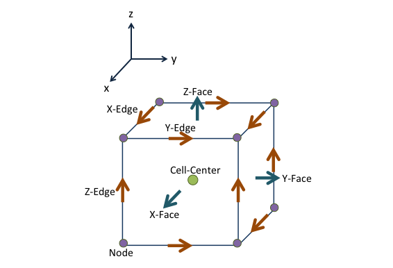

# Finite Volume Method

The numerical approximation comes in when we define state variables at cell centers and fluxes at cell faces: the question of how to get the flux on faces from cell-centered states is the key to finite volumn method. In BATS-R-US, we use blocks to organize cells and distribute them among MPI processes.
 


shows the simplest block structure in 3D Cartesian coordinates consisting of ``10\times10\times10`` cells.



shows one cell in 3D Cartesian coordinates. For each face of the cell, we use left and right states to denote the states on the two sides of interface.

Let us denote the approximate fluxes at faces with ``\widehat{F}``, the left states with subscript ``L`` and right states with subscript ``R``. The simplest flux function in MHD is the _local Lax-Friedrichs_, or _Rusanov_ flux, given by
```math
\widehat{\mathbf{F}} = \frac12(\mathbf{F}_L+\mathbf{F}_R)-\frac12 c_{max}(\mathbf{U}_R-\mathbf{U}_L),
```
where ``\mathbf{F}_L = \mathbf{F}(\mathbf{U}_L),\ \mathbf{F}_R = \mathbf{F}(\mathbf{U}_R)``, and ``c_{max}`` is the maximum speed of any wave in the system, considering both ``\mathbf{U}_L`` and ``\mathbf{U}_R``. (_It is the same for all flux calculations on this face, but different at different faces!_) In ideal MHD, this maximum wave speed can be expressed as
```math
c_{\max} =c_{\max}(\mathbf{U}_L,\mathbf{U}_R,\widehat{n}_{i,e}) =  |\bar u_n| + \sqrt{ \frac{c_f^2+  \sqrt{c_f^4 - 4 c_s^2 c^2_{A,n}}}{2}},
```
where the fast magnetosonic speed squared is
```math
  c_f^2 = c_s^2 + c_A^2,
```
the sound speed squared is
```math
  c_s^2 = \frac{\gamma \bar p}{\bar \rho}=\frac{\gamma (p_L+p_R)}{\rho_L+\rho_R},
```
the Alfvén speed squared is
```math
  c_A^2 = \frac{\bar B^2}{\bar \rho} = \frac{[(B_{xL}+B_{xR})^2+(B_{yL}+B_{yR})^2+(B_{zL}+B_{zR})^2]}{2(\rho_L+\rho_R)}
```
and the normal component of the Alfvén speed squared is 
```math
  c_{A,n}^2 = \frac{\bar B_n^2}{\bar \rho} = c_A^2 |\widehat{n}_{f}|
```

!!! note
    Physically the Alfvén velocity is written as ``\mathbf{c}_A = \frac{\mathbf{B}^2}{\rho}``(``\mu_0`` is absorbed into ``\mathbf{B}`` in the normalized units). At cell faces, we take the average of the magnetic field and densities between neighboring cell centers to get the velocity on the faces: ``\mathbf{c}_\text{Aface} = \frac{\bar{\mathbf{B}}^2}{\bar{\rho}}.`` The normal component of the Alfvén velocity to the face is then ``\mathbf{c}_{An} =  \frac{(\bar{\mathbf{B}}\cdot\widehat{n}_f)^2}{\bar{\rho}},`` and Alfvén speed is just the magnitude of this.


In the discretization form, assuming we are using first-order forward Euler method in time, integrating over the whole cell ``i`` and taking cell averages at the center, the compact conservative form of the MHD equations gives
```math
V_i\frac{1}{\Delta t_i^n}(u_i^{n+1}-u_i^n)+\sum_{f=1}^6\widehat{F}(u_i,u_{e},\widehat{n}_{f})A_{f} = V_i S_i^n,
```
where ``V_i`` is the volume of the ``i^{th}`` cell, ``A_{f}`` is the face area of ``f`` (between cell ``i`` and its adjacent cell ``e``), ``\widehat{F}`` is the flux function between cell ``i`` and cell ``e``, ``u_{f}`` is the state variables in adjacent cell ``e``, ``\widehat{n}_{f}`` is the face normal vector pointing from cell ``i`` to cell ``e``, and superscript ``n`` is the timestep. The second term on the LHS gives the integrated normal flux of state ``u`` on face between cell ``i`` and cell ``e``. Rewrite the above equation, we get
```math
u_i^{n+1}  = u_i^n - \frac{\Delta t_i^n}{V_i}\Big( \sum_{f=1}^6\widehat{F}(u_i,u_{e},\widehat{n}_{f})A_{f}\Big) + \Delta t_i^n S_i^n ,
```math
which is the explicit update equation for state variables from timestep ``n`` to ``n+1``.

Finally, to set the discrete timestep, we apply the CFL condition for numerical stability. 
```math
\Delta t_i = \text{CFL}\frac{V_i}{|s_{ix}|A_{ix} + |s_{iy}|A_{iy} + |s_{iz}|A_{iz}}= \text{CFL} \frac{1}{\frac{|s_{ix}|}{\Delta x}+\frac{|s_{iy}|}{\Delta y}+\frac{|s_{iz}|}{\Delta z}},
```
where CFL number is a constant over all cells, prescribed by the user, and ``|s|_i`` is the maximum wave speed in cell ``i``. For general cases, this is the same as ``c_{\max}`` used for flux function.

!!! warning
    Be careful: this time the maximum wave speed is defined in cell centers, not faces. So instead of using the average states between two cells, you only need cell center states of ``i`` to compute this ``|s|_i``. In my first MATLAB version of the code, I made a mistake initially by using the maximum of the face ``c_{\max}`` instead of calculating cell-centered ``c_{\max}`` directly. This resulted in oscillation behaviors in certain regions.

!!! note
    Dante is a simplified version of BATS-R-US, which is a generalized code that can handle different coordinates with different mesh sizes. Therefore we shouldn't simplify the calculations too much even though it is good as a start. Also note that what`s been shown here is the simplest first-order explicit scheme: we have much more complicated schemes with higher-order and a mixture of implicit-explicit implementations.

